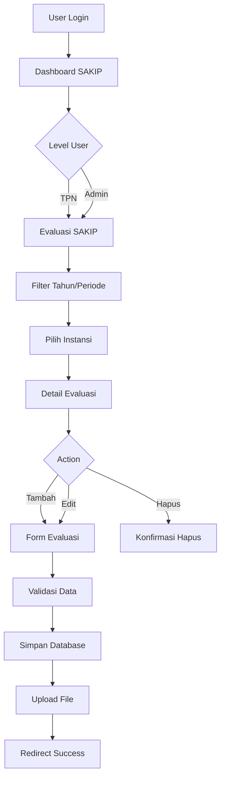

# Dokumentasi Fitur SAKIP (Sistem Akuntabilitas Kinerja Instansi Pemerintah)

## Daftar Isi
- [1. Pendahuluan](#1-pendahuluan)
- [2. Arsitektur Sistem](#2-arsitektur-sistem)
- [3. Routes (Routing)](#3-routes-routing)
- [4. Controllers](#4-controllers)
- [5. Views (Tampilan)](#5-views-tampilan)
- [6. Models & Database](#6-models--database)
- [7. Fitur-Fitur Utama](#7-fitur-fitur-utama)
- [8. Dependencies & Libraries](#8-dependencies--libraries)
- [9. API Endpoints](#9-api-endpoints)
- [10. Panduan Pengembangan](#10-panduan-pengembangan)

---

## 1. Pendahuluan

### 1.1 Deskripsi Fitur SAKIP
Fitur SAKIP (Sistem Akuntabilitas Kinerja Instansi Pemerintah) adalah modul yang dirancang untuk mengelola evaluasi kinerja instansi pemerintah, baik Kementerian/Lembaga maupun Pemerintah Daerah. Sistem ini memungkinkan tim evaluasi untuk melakukan penilaian komprehensif terhadap kinerja instansi berdasarkan standar SAKIP.

### 1.2 Tujuan dan Fungsi Utama
- **Evaluasi Kinerja**: Melakukan penilaian terhadap 4 komponen utama SAKIP
- **Progress Tracking**: Memantau kemajuan pengisian evaluasi per tim
- **Data Management**: Mengelola data evaluasi dengan fitur CRUD lengkap
- **Reporting**: Menyediakan laporan evaluasi dengan berbagai filter
- **File Management**: Mengelola dokumen pendukung evaluasi

### 1.3 Komponen Evaluasi SAKIP
1. **Perencanaan Kinerja** - Penilaian terhadap perencanaan kinerja instansi
2. **Pengukuran Kinerja** - Evaluasi sistem pengukuran kinerja
3. **Pelaporan Kinerja** - Penilaian kualitas pelaporan kinerja
4. **Evaluasi Internal** - Assessment terhadap evaluasi internal instansi

---

## 2. Arsitektur Sistem

### 2.1 Struktur Folder dan File

```
portalrb/
├── app/
│   ├── Http/Controllers/Akip/
│   │   └── EvaluasiSakipController.php
│   └── Models/Akip/
│       └── EvaluasiSakip.php
├── resources/views/akip/
│   ├── dashboard.blade.php
│   └── evaluasi/
│       ├── tim.blade.php
│       └── instansi.blade.php
├── routes/
│   └── akip.php
├── database/migrations/
│   ├── 2025_06_11_051540_create_evaluasi_sakip_table.php
│   └── 2025_07_23_162238_alter_evaluasi_sakip_tabel.php
└── doc/
    └── SAKIP_DOCUMENTATION.md
```

### 2.2 Diagram Alur Sistem



---

## 3. Routes (Routing)

### 3.1 Route Group SAKIP

Semua route SAKIP dikelompokkan dengan prefix `/akip` dan middleware `auth`.

**File**: `routes/akip.php`

```php
Route::group(['prefix' => 'akip', 'as' => 'akip.'], function () {
    Route::middleware('auth')->group(function () {
        // Routes implementation
    });
});
```

### 3.2 Daftar Routes Lengkap

| Method | URL | Controller Method | Name | Description |
|--------|-----|-------------------|------|-------------|
| GET | `/akip/dashboard` | `dashboard` | `akip.dashboard` | Dashboard SAKIP dengan progress tracking |
| GET | `/akip/evaluasi/sakip` | `evaluasi_sakip` | `akip.evaluasi.sakip` | Halaman evaluasi SAKIP utama |
| GET | `/akip/evaluasi/sakip/{instansi_id}` | `evaluasi_sakip_instansi` | - | Detail evaluasi per instansi |
| GET | `/akip/evaluasi/sakip/{instansi_id}/getData/{id}` | `evaluasi_sakip_instansi_getData` | - | Get data evaluasi berdasarkan ID |
| POST | `/akip/evaluasi/sakip/{instansi_id}/simpan` | `evaluasi_sakip_instansi_simpan` | - | Simpan/update evaluasi SAKIP |
| POST | `/akip/evaluasi/sakip/{instansi_id}/cekPeriode` | `evaluasi_sakip_instansi_cekPeriode` | - | Validasi periode evaluasi |
| DELETE | `/akip/evaluasi/sakip/{instansi_id}/hapus/{id}` | `evaluasi_sakip_instansi_hapus` | - | Hapus data evaluasi |
| POST | `/akip/evaluasi/sakip/search` | `evaluasi_sakip_search` | `akip.evaluasi.sakip.search` | AJAX search dengan pagination |
| GET | `/akip/dashboard/filter` | `filterDashboard` | `akip.dashboard.filter` | Filter dashboard untuk Pemda |
| GET | `/akip/dashboard/filter/kl` | `filterDashboardKl` | `akip.dashboard.filter.kl` | Filter dashboard untuk K/L |

### 3.3 Contoh Penggunaan Routes

```php
// Redirect ke dashboard SAKIP
return redirect()->route('akip.dashboard');

// AJAX search evaluasi
$.post('{{ route("akip.evaluasi.sakip.search") }}', {
    tahun: 2025,
    search_kl: 'Kementerian',
    search_pemda: 'Provinsi',
    page_kl: 1,
    page_pemda: 1
});

// Filter dashboard
$.get('{{ route("akip.dashboard.filter") }}', {
    tahun: 2025,
    periode: 1
});
```

---

## 4. Controllers

### 4.1 EvaluasiSakipController

**File**: `app/Http/Controllers/Akip/EvaluasiSakipController.php`
**Namespace**: `App\Http\Controllers\Akip`

#### 4.1.1 Constructor dan Middleware

```php
public function __construct()
{
    $this->middleware(function ($request, $next) {
        $this->currentUser = auth()->user();
        foreach (allowed_url('akip') as $allowed) {
            if ($request->is($allowed)) {
                return $next($request);
            }
        }
        abort('403');
    });
}
```

#### 4.1.2 Method Dashboard

```php
public function dashboard(Request $request)
{
    // Get level user
    $level = $this->currentUser->level;
    
    if ($level == 'tpn') {
        // Logic untuk TPN
        $tims = // Get tim data
        $tims_kl = // Get K/L tim data
    }
    
    return view('akip.dashboard', compact('tims', 'tims_kl', 'level'));
}
```

**Fungsi**:
- Menampilkan dashboard SAKIP
- Progress tracking untuk Pemda dan K/L
- Filter berdasarkan tahun dan periode

#### 4.1.3 Method Evaluasi SAKIP

```php
public function evaluasi_sakip(Request $request)
{
    // Validasi tahun
    $tahun = $request->input('tahun', date('Y'));
    $tahun = is_numeric($tahun) && $tahun >= 2020 && $tahun <= date('Y') ? (int) $tahun : date('Y');
    
    // Get search parameters
    $search_kl = $request->input('search_kl', '');
    $search_pemda = $request->input('search_pemda', '');
    
    // Pisahkan data K/L dan Pemda
    $anggota_kl = collect();
    $anggota_pemda = collect();
    
    // Logic untuk memisahkan data
    foreach ($anggota_tims as $anggota_tim) {
        if ($anggota_tim->instansi->group == 'kl') {
            $anggota_kl->push($anggota_tim);
        } else {
            $anggota_pemda->push($anggota_tim);
        }
    }
    
    return view('akip.evaluasi.tim', compact('anggota_kl', 'anggota_pemda', 'tahun'));
}
```

**Fungsi**:
- Menampilkan halaman evaluasi SAKIP
- Filter berdasarkan tahun, search K/L, dan search Pemda
- Pagination untuk data K/L dan Pemda

#### 4.1.4 Method Simpan Evaluasi

```php
public function evaluasi_sakip_instansi_simpan($instansi_id)
{
    DB::beginTransaction();
    $success = false;
    
    try {
        $evaluasi_sakip = new EvaluasiSakip();
        $evaluasi_sakip->instansi_id = $instansi_id;
        $evaluasi_sakip->input_user_id = $this->currentUser->id;
        $evaluasi_sakip->last_update_user_id = $this->currentUser->id;
        
        // Set data dari request
        $evaluasi_sakip->tahun = $request->tahun;
        $evaluasi_sakip->periode = $request->periode;
        $evaluasi_sakip->penanggung_jawab = $request->penanggung_jawab;
        // ... set other fields
        
        if ($evaluasi_sakip->save()) {
            $success = true;
            
            // Handle file upload
            if ($request->hasFile('file_evaluasi')) {
                $filename = 'file_evaluasi_' . $evaluasi_sakip->instansi_id . '_' . 
                           $evaluasi_sakip->tahun . '_' . $evaluasi_sakip->periode . '.pdf';
                $request->file('file_evaluasi')->storeAs('akip', $filename, 'public');
                $evaluasi_sakip->file_evaluasi = $filename;
                $evaluasi_sakip->save();
            }
        }
    } catch (\Throwable $th) {
        DB::rollBack();
        throw $th;
    }
    
    if ($success) {
        DB::commit();
        return redirect('akip/evaluasi/sakip/' . $instansi_id)
               ->with('success', 'Data evaluasi SAKIP berhasil disimpan.');
    } else {
        DB::rollBack();
        return redirect()->back()
               ->with('error', 'Gagal menyimpan data evaluasi SAKIP. Silakan coba lagi.');
    }
}
```

**Fungsi**:
- Menyimpan data evaluasi SAKIP
- Handle file upload
- Database transaction untuk konsistensi data

#### 4.1.5 Method AJAX Search

```php
public function evaluasi_sakip_search(Request $request)
{
    try {
        // Validate request
        $request->validate([
            'tahun' => 'required|integer|min:2020|max:' . date('Y'),
            'search_kl' => 'nullable|string|max:255',
            'search_pemda' => 'nullable|string|max:255',
            'page_kl' => 'nullable|integer|min:1',
            'page_pemda' => 'nullable|integer|min:1'
        ]);
        
        // Get parameters
        $tahun = (int) $request->input('tahun');
        $search_kl = trim($request->input('search_kl', ''));
        $search_pemda = trim($request->input('search_pemda', ''));
        $currentPageKl = max(1, (int) $request->input('page_kl', 1));
        $currentPagePemda = max(1, (int) $request->input('page_pemda', 1));
        
        // Process search logic
        // ...
        
        return response()->json([
            'success' => true,
            'klTableContent' => $klTableContent,
            'pemdaTableContent' => $pemdaTableContent,
            'klPaginationInfo' => $klPaginationInfo,
            'pemdaPaginationInfo' => $pemdaPaginationInfo
        ]);
        
    } catch (\Exception $e) {
        return response()->json([
            'success' => false,
            'message' => 'Terjadi kesalahan: ' . $e->getMessage()
        ], 500);
    }
}
```

**Fungsi**:
- AJAX search dengan pagination
- Support search terpisah untuk K/L dan Pemda
- Return JSON response untuk frontend

---

## 5. Views (Tampilan)

### 5.1 Dashboard SAKIP

**File**: `resources/views/akip/dashboard.blade.php`

#### 5.1.1 Layout dan Struktur

```php
@extends('layout.midone', ['akip' => true])
@section('title', 'Dashboard')
```

#### 5.1.2 Komponen Utama

**Card Navigasi**:
```html
<!-- Evaluasi Akip Card -->
<div class="col-span-12 sm:col-span-4 2xl:col-span-3 intro-y">
    <x-bladewind::card
        class="hover:shadow-lg hover:border-blue-300 hover:bg-blue-50 transition-all duration-300 cursor-pointer group"
        onclick="window.location.href='{{ url('akip/evaluasi/sakip') }}'"
    >
        <div class="flex items-center">
            <div class="w-2/4 flex-none">
                <div class="text-lg font-bold truncate text-gray-800 group-hover:text-blue-700 transition-colors duration-300">Evaluasi Akip</div>
                <div class="text-slate-500 mt-1 text-sm group-hover:text-blue-600 transition-colors duration-300">Hasil Evaluasi Sakip</div>
            </div>
            <div class="flex-none ml-auto relative">
                <div class="w-[90px] h-[90px] bg-blue-50 rounded-full flex items-center justify-center group-hover:bg-blue-100 transition-colors duration-300">
                    <i data-feather="bar-chart-2" class="w-12 h-12 text-blue-600 group-hover:text-blue-700 transition-colors duration-300"></i>
                </div>
            </div>
        </div>
    </x-bladewind::card>
</div>
```

**Progress Tracking Table**:
```html
<x-bladewind::table
    striped="true"
    has_border="true"
    has_shadow="true"
    compact="true"
    divider="thin"
    has_hover="true"
>
    <x-slot name="header">
        <th>Nama Tim</th>
        <th class="text-center">Jumlah Pemda yang Dikelola</th>
        <th class="text-center">Jumlah Pemda yang Telah Diisi</th>
        <th class="text-center">Progress Pengisian</th>
    </x-slot>
    <tbody id="table-pda">
        @foreach ($tims as $tim)
            <tr>
                <td>{{ $tim->nama }} ({{ $tim->keterangan }})</td>
                <td class="text-center">{{ $tim->total_instansi }}</td>
                <td class="text-center">{{ $tim->total_instansi_filled }}</td>
                <td class="text-center">
                    @if ($tim->total_instansi > 0)
                        @php
                            $progress = ($tim->total_instansi_filled / $tim->total_instansi) * 100;
                            $badgeClass = $progress >= 80 ? 'bg-green-100 text-green-800' : ($progress >= 50 ? 'bg-yellow-100 text-yellow-800' : 'bg-red-100 text-red-800');
                        @endphp
                        <span class="inline-flex items-center px-2.5 py-0.5 rounded-full text-xs font-medium {{ $badgeClass }}">
                            {{ number_format($progress, 2) }}%
                        </span>
                    @else
                        <span class="inline-flex items-center px-2.5 py-0.5 rounded-full text-xs font-medium bg-gray-100 text-gray-800">
                            0%
                        </span>
                    @endif
                </td>
            </tr>
        @endforeach
    </tbody>
</x-bladewind::table>
```

#### 5.1.3 JavaScript Functionality

```javascript
// Filter functionality
function filterData() {
    const tahun = $('input[name="tahun"]').val();
    const periode = $('input[name="periode"]').val();
    
    if (!tahun || !periode) {
        alert('Silakan pilih tahun dan periode terlebih dahulu.');
        return;
    }
    
    loadData(tahun, periode);
}

// Load data with AJAX
function loadData(tahun, periode) {
    showLoading();
    
    $.get('{{ route('akip.dashboard.filter') }}', {
        tahun,
        periode
    })
    .done(response => {
        $('#tahun-display').text(tahun);
        $('#tw-display').text(periode);
        updateTable(response.tims);
        hideLoading();
    })
    .fail(xhr => {
        alert('Error loading data. Please try again.');
        hideLoading();
        console.error(xhr);
    });
}
```

### 5.2 Evaluasi Tim

**File**: `resources/views/akip/evaluasi/tim.blade.php`

#### 5.2.1 Filter Section

```html
<div class="intro-y box p-5 mt-5">
    <div class="flex items-center mb-5 pb-5 border-b border-gray-200">
        <h3 class="font-medium text-base mr-auto">Filter Data</h3>
    </div>
    <form method="GET" action="{{ url('akip/evaluasi/sakip') }}" id="filterForm" class="flex items-center gap-4">
        <div class="flex-1 min-w-[200px]">
            <x-bladewind::select
                name="tahun"
                id="tahun"
                label="Tahun"
                placeholder="Pilih Tahun"
                :data="$tahunOptions"
                selected_value="{{ $tahun }}"
                searchable="true"
                size="medium"
                class="shadow-sm"
            />
        </div>
        <input type="hidden" name="search_kl" value="{{ $search_kl ?? '' }}">
        <input type="hidden" name="search_pemda" value="{{ $search_pemda ?? '' }}">
    </form>
</div>
```

#### 5.2.2 Search Functionality

```javascript
// Global state management
let searchState = {
    tahun: '{{ $tahun }}',
    searchKl: '{{ $search_kl ?? "" }}',
    searchPemda: '{{ $search_pemda ?? "" }}',
    pageKl: {{ $currentPageKl ?? 1 }},
    pagePemda: {{ $currentPagePemda ?? 1 }},
    isLoadingKl: false,
    isLoadingPemda: false,
    searchTimeout: null
};

// Search with debouncing
function handleSearch(type, value) {
    if (searchState.searchTimeout) {
        clearTimeout(searchState.searchTimeout);
    }
    
    if (type === 'kl') {
        searchState.searchKl = value;
        searchState.pageKl = 1;
    } else {
        searchState.searchPemda = value;
        searchState.pagePemda = 1;
    }
    
    searchState.searchTimeout = setTimeout(() => {
        performSearch(type);
    }, 500);
}
```

### 5.3 Evaluasi Instansi

**File**: `resources/views/akip/evaluasi/instansi.blade.php`

#### 5.3.1 Form Evaluasi

```html
<div class="modal" id="modal-form-evaluasi">
    <div class="modal__content modal__content--xl">
        <div class="flex items-center px-5 py-5 sm:py-3 border-b border-gray-200">
            <h2 class="font-medium text-base mr-auto" id="modal-title-evaluasi">
                Tambah Penilaian
            </h2>
        </div>
        {{ html()->form('POST', '/akip/evaluasi/sakip/' . $instansi->id . '/simpan')->id('form-sakip')->class('validate-form')->acceptsFiles()->open() }}
        
        <div class="p-5 grid grid-cols-12 gap-4 row-gap-3">
            <!-- Form fields -->
            <div class="col-span-12 lg:col-span-6">
                <div class="input-group">
                    {{ html()->label('Tahun')->for('tahun') }} <span class="text-theme-6">*</span>
                    <div class="mt-2">
                        {{ html()->select('tahun', ['2025' => '2025'], 2025)->id('tahun')->class('select2 w-full hide-search')->placeholder('Pilih Tahun')->attributes(['onchange' => 'cekPeriode();'])->required() }}
                    </div>
                </div>
            </div>
        </div>
    </div>
</div>
```

#### 5.3.2 Rich Text Editor

```javascript
$(document).ready(function() {
    $('.editor').each(function() {
        var $this = $(this);
        $this.summernote({
            placeholder: $this.attr('placeholder'),
            toolbar: [
                ['style', ['bold', 'italic', 'underline', 'clear']],
                ['font', ['strikethrough', 'superscript', 'subscript']]
            ],
            height: 100,
            callbacks: {
                onPaste: function(e) {
                    e.preventDefault();
                    const clipboardData = (e.originalEvent || e).clipboardData;
                    const text = clipboardData.getData('text/plain');
                    document.execCommand('insertText', false, text);
                }
            }
        });
    });
});
```

#### 5.3.3 Input Mask untuk Angka

```javascript
$(".digit").inputmask("decimal", {
    radixPoint: ",", // koma sebagai pemisah desimal
    groupSeparator: ".", // titik sebagai pemisah ribuan
    digits: 2, // maksimal 2 digit di belakang koma
    autoGroup: false,
    rightAlign: false,
    min: 0,
    max: 100,
    allowMinus: false,
    allowPlus: false,
    placeholder: '0',
    showMaskOnHover: false,
    showMaskOnFocus: false,
    inputmode: "numeric"
});
```

---

## 6. Models & Database

### 6.1 Model EvaluasiSakip

**File**: `app/Models/Akip/EvaluasiSakip.php`

```php
<?php

namespace App\Models\Akip;

use App\Models\KlpdInstansi;
use Illuminate\Database\Eloquent\Factories\HasFactory;
use Illuminate\Database\Eloquent\Model;
use Illuminate\Database\Eloquent\SoftDeletes;

class EvaluasiSakip extends Model
{
    use HasFactory, SoftDeletes;
    
    protected $table = 'evaluasi_sakip';
    
    protected $fillable = [
        'instansi_id',
        'input_user_id',
        'last_update_user_id',
        'tahun',
        'periode',
        'penanggung_jawab',
        'pic_lke',
        'link_lke',
        'nilai_komponen_perencanaan_kinerja',
        'nilai_komponen_pengukuran_kinerja',
        'nilai_komponen_pelaporan_kinerja',
        'nilai_komponen_evaluasi_internal',
        'nilai_total_evaluasi_akip',
        'nilai_komponen_perencanaan_kinerja_tahun_lalu',
        'nilai_komponen_pengukuran_kinerja_tahun_lalu',
        'nilai_komponen_pelaporan_kinerja_tahun_lalu',
        'nilai_komponen_evaluasi_internal_tahun_lalu',
        'nilai_total_evaluasi_akip_tahun_lalu',
        'catatan_komponen_perencanaan_kinerja',
        'catatan_komponen_pengukuran_kinerja',
        'catatan_komponen_pelaporan_kinerja',
        'catatan_komponen_evaluasi_internal',
        'rekomendasi_komponen_perencanaan_kinerja',
        'rekomendasi_komponen_pengukuran_kinerja',
        'rekomendasi_komponen_pelaporan_kinerja',
        'rekomendasi_komponen_evaluasi_internal',
        'angka_kemiskinan',
        'laju_pertumbuhan_ekonomi',
        'tingkat_pengangguran_terbuka',
        'penurunan_emisi_grk',
        'indeks_pembangunan_manusia',
        'indeks_gini_ratio',
        'pendapatan_perkapita',
        'angka_kemiskinan_tahun_lalu',
        'laju_pertumbuhan_ekonomi_tahun_lalu',
        'tingkat_pengangguran_terbuka_tahun_lalu',
        'penurunan_emisi_grk_tahun_lalu',
        'indeks_pembangunan_manusia_tahun_lalu',
        'indeks_gini_ratio_tahun_lalu',
        'pendapatan_perkapita_tahun_lalu',
        'file_evaluasi'
    ];
    
    public function instansi()
    {
        return $this->belongsTo(KlpdInstansi::class, 'instansi_id');
    }
}
```

### 6.2 Database Schema

#### 6.2.1 Migration Create Table

**File**: `database/migrations/2025_06_11_051540_create_evaluasi_sakip_table.php`

```php
Schema::create('evaluasi_sakip', function (Blueprint $table) {
    $table->id();
    $table->foreignId('instansi_id');
    $table->foreignId('input_user_id');
    $table->foreignId('last_update_user_id');
    $table->integer('tahun');
    $table->string('periode')->nullable();
    $table->string('penanggung_jawab');
    $table->string('pic_lke');
    $table->string('link_lke');
    
    // Nilai komponen evaluasi
    $table->float('nilai_komponen_perencanaan_kinerja');
    $table->float('nilai_komponen_pengukuran_kinerja');
    $table->float('nilai_komponen_pelaporan_kinerja');
    $table->float('nilai_komponen_evaluasi_internal');
    $table->float('nilai_total_evaluasi_akip');
    
    // Nilai tahun lalu
    $table->float('nilai_komponen_perencanaan_kinerja_tahun_lalu');
    $table->float('nilai_komponen_pengukuran_kinerja_tahun_lalu');
    $table->float('nilai_komponen_pelaporan_kinerja_tahun_lalu');
    $table->float('nilai_komponen_evaluasi_internal_tahun_lalu');
    $table->float('nilai_total_evaluasi_akip_tahun_lalu');
    
    // Catatan dan rekomendasi
    $table->text('catatan_komponen_perencanaan_kinerja')->nullable();
    $table->text('catatan_komponen_pengukuran_kinerja')->nullable();
    $table->text('catatan_komponen_pelaporan_kinerja')->nullable();
    $table->text('catatan_komponen_evaluasi_internal')->nullable();
    $table->text('rekomendasi_komponen_perencanaan_kinerja')->nullable();
    $table->text('rekomendasi_komponen_pengukuran_kinerja')->nullable();
    $table->text('rekomendasi_komponen_pelaporan_kinerja')->nullable();
    $table->text('rekomendasi_komponen_evaluasi_internal')->nullable();
    
    // Indikator makro (untuk Pemda)
    $table->float('angka_kemiskinan')->nullable();
    $table->float('laju_pertumbuhan_ekonomi')->nullable();
    $table->float('tingkat_pengangguran_terbuka')->nullable();
    $table->float('penurunan_emisi_grk')->nullable();
    $table->float('indeks_pembangunan_manusia')->nullable();
    $table->float('indeks_gini_ratio')->nullable();
    $table->float('pendapatan_perkapita')->nullable();
    
    // Indikator makro tahun lalu
    $table->float('angka_kemiskinan_tahun_lalu')->nullable();
    $table->float('laju_pertumbuhan_ekonomi_tahun_lalu')->nullable();
    $table->float('tingkat_pengangguran_terbuka_tahun_lalu')->nullable();
    $table->float('penurunan_emisi_grk_tahun_lalu')->nullable();
    $table->float('indeks_pembangunan_manusia_tahun_lalu')->nullable();
    $table->float('indeks_gini_ratio_tahun_lalu')->nullable();
    $table->float('pendapatan_perkapita_tahun_lalu')->nullable();
    
    $table->string('file_evaluasi')->nullable();
    $table->timestamps();
    $table->softDeletes();
});
```

#### 6.2.2 Migration Alter Table

**File**: `database/migrations/2025_07_23_162238_alter_evaluasi_sakip_tabel.php`

```php
Schema::table('evaluasi_sakip', function (Blueprint $table) {
    $table->decimal('pendapatan_perkapita_tahun_lalu', 12, 2)->nullable()->change();
    $table->decimal('pendapatan_perkapita', 12, 2)->nullable()->change();
});
```

### 6.3 Relationships

```php
// EvaluasiSakip belongs to KlpdInstansi
public function instansi()
{
    return $this->belongsTo(KlpdInstansi::class, 'instansi_id');
}

// KlpdInstansi has many EvaluasiSakip
public function evaluasiSakip()
{
    return $this->hasMany(EvaluasiSakip::class, 'instansi_id');
}
```

---

## 7. Fitur-Fitur Utama

### 7.1 Dashboard dengan Progress Tracking

#### 7.1.1 Progress Pemda
- **TW 1-4 Tracking**: Memantau pengisian evaluasi per triwulan
- **Progress Percentage**: Menampilkan persentase pengisian per tim
- **Color Coding**: 
  - 🟢 Hijau: ≥80% (Baik)
  - 🟡 Kuning: 50-79% (Sedang)
  - 🔴 Merah: <50% (Perlu Perhatian)

#### 7.1.2 Progress K/L
- **Annual Tracking**: Evaluasi tahunan untuk K/L
- **Status Indicators**: Sudah/Belum dinilai
- **Filter by Year**: Filter berdasarkan tahun evaluasi

### 7.2 Evaluasi SAKIP (CRUD)

#### 7.2.1 Create (Tambah)
```php
// Validasi periode
public function evaluasi_sakip_instansi_cekPeriode($instansi_id)
{
    $tahun = request('tahun');
    $periode = request('periode');
    
    $exists = EvaluasiSakip::where('instansi_id', $instansi_id)
                          ->where('tahun', $tahun)
                          ->where('periode', $periode)
                          ->exists();
    
    return response()->json(['exists' => $exists]);
}
```

#### 7.2.2 Read (Lihat)
```php
// Get data evaluasi
public function evaluasi_sakip_instansi_getData($instansi_id, $id)
{
    $evaluasi = EvaluasiSakip::with('instansi')->find($id);
    return response()->json(['evaluasi_sakip' => $evaluasi]);
}
```

#### 7.2.3 Update (Edit)
```php
// Update existing evaluasi
public function evaluasi_sakip_instansi_simpan($instansi_id)
{
    $id = request('id_evaluasi');
    
    if ($id) {
        $evaluasi_sakip = EvaluasiSakip::find($id);
    } else {
        $evaluasi_sakip = new EvaluasiSakip();
    }
    
    // Update fields
    $evaluasi_sakip->instansi_id = $instansi_id;
    // ... set other fields
    
    $evaluasi_sakip->save();
}
```

#### 7.2.4 Delete (Hapus)
```php
// Soft delete evaluasi
public function evaluasi_sakip_instansi_hapus($instansi_id, $id)
{
    $evaluasi_sakip = EvaluasiSakip::find($id);
    if ($evaluasi_sakip) {
        return $evaluasi_sakip->delete();
    }
    return false;
}
```

### 7.3 Filter dan Pencarian

#### 7.3.1 Filter Dashboard
```javascript
// Filter berdasarkan tahun dan periode
function filterData() {
    const tahun = $('input[name="tahun"]').val();
    const periode = $('input[name="periode"]').val();
    
    $.get('{{ route('akip.dashboard.filter') }}', {
        tahun,
        periode
    })
    .done(response => {
        updateTable(response.tims);
    });
}
```

#### 7.3.2 Search dengan Debouncing
```javascript
// Search dengan delay 500ms
function handleSearch(type, value) {
    if (searchState.searchTimeout) {
        clearTimeout(searchState.searchTimeout);
    }
    
    searchState.searchTimeout = setTimeout(() => {
        performSearch(type);
    }, 500);
}
```

### 7.4 Upload File

#### 7.4.1 File Upload Handler
```php
// Handle file upload
if ($request->hasFile('file_evaluasi')) {
    $filename = 'file_evaluasi_' . $evaluasi_sakip->instansi_id . '_' . 
               $evaluasi_sakip->tahun . '_' . $evaluasi_sakip->periode . '.pdf';
    $request->file('file_evaluasi')->storeAs('akip', $filename, 'public');
    $evaluasi_sakip->file_evaluasi = $filename;
    $evaluasi_sakip->save();
}
```

#### 7.4.2 File Download
```html
<!-- Download file evaluasi -->
@if (!empty($evaluasi->file_evaluasi))
    <a href="{{ asset('storage/akip/' . $evaluasi->file_evaluasi) }}" 
       target="_blank" 
       class="button border items-center text-gray-700 flex ml-3">
        <i data-feather="file" class="w-4 h-4 mr-2"></i>
        {{ $evaluasi->periode != 'Final' ? 'Download File Catatan Evaluasi' : 'Download File Surat Pengantar LHE' }}
    </a>
@endif
```

### 7.5 Validasi dan Error Handling

#### 7.5.1 Form Validation
```javascript
var validator = $('#form-sakip').validate({
    ignore: [],
    errorPlacement: function(error, element) {
        if (element.hasClass('select2-hidden-accessible')) {
            error.insertAfter(element.next('.select2-container'));
        } else {
            error.insertAfter(element.closest('.input-group'));
        }
    },
    highlight: function(element) {
        if ($(element).hasClass('select2-hidden-accessible')) {
            $(element).next('.select2-container')
                .find('.select2-selection')
                .addClass('border border-red-500');
        } else {
            $(element).addClass('border-red-500');
        }
    },
    submitHandler: function(form) {
        $('.saveButton').prop('disabled', true);
        form.submit();
    }
});
```

#### 7.5.2 Database Transaction
```php
DB::beginTransaction();
$success = false;

try {
    // Database operations
    $evaluasi_sakip->save();
    $success = true;
} catch (\Throwable $th) {
    DB::rollBack();
    throw $th;
}

if ($success) {
    DB::commit();
    return redirect()->with('success', 'Data berhasil disimpan.');
} else {
    DB::rollBack();
    return redirect()->back()->with('error', 'Gagal menyimpan data.');
}
```

---

## 8. Dependencies & Libraries

### 8.1 Frontend Dependencies

#### 8.1.1 BladewindUI Components
```html
<!-- Card Component -->
<x-bladewind::card class="hover:shadow-lg">
    <!-- Card content -->
</x-bladewind::card>

<!-- Table Component -->
<x-bladewind::table striped="true" has_border="true">
    <!-- Table content -->
</x-bladewind::table>

<!-- Select Component -->
<x-bladewind::select
    name="tahun"
    label="Tahun"
    :data="$tahunOptions"
    searchable="true"
/>
```

#### 8.1.2 jQuery & Plugins
```html
<!-- jQuery -->
<script src="https://code.jquery.com/jquery-3.6.0.min.js"></script>

<!-- jQuery Validation -->
<script src="{{ asset('ext/jquery-validation/jquery.validate.min.js') }}"></script>
<script src="{{ asset('ext/jquery-validation/localization/messages_id.min.js') }}"></script>

<!-- Input Mask -->
<script src="{{ asset('ext/jquery-inputmask/jquery.inputmask.bundle.js') }}"></script>

<!-- Summernote Rich Text Editor -->
<script src="{{ asset('ext/summernote/summernote-lite.min.js') }}"></script>
<link rel="stylesheet" href="{{ asset('ext/summernote/summernote-lite.min.css') }}" />
```

#### 8.1.3 SweetAlert2
```javascript
// Success notification
Swal.fire('Berhasil!', 'Data berhasil disimpan.', 'success');

// Confirmation dialog
Swal.fire({
    title: "Yakin?",
    text: "Hapus data ini?",
    icon: 'warning',
    showCancelButton: true,
    confirmButtonColor: "#DD6B55",
    confirmButtonText: "Ya, hapus aja!"
}).then((result) => {
    if (result.isConfirmed) {
        // Delete action
    }
});
```

### 8.2 Backend Dependencies

#### 8.2.1 Laravel Framework
```php
// Eloquent ORM
use Illuminate\Database\Eloquent\Model;
use Illuminate\Database\Eloquent\SoftDeletes;

// Database Transactions
use Illuminate\Support\Facades\DB;

// File Storage
use Illuminate\Support\Facades\Storage;
```

#### 8.2.2 Laravel Packages
```php
// Soft Deletes
use Illuminate\Database\Eloquent\SoftDeletes;

// Form Builder
use Collective\Html\FormBuilder;

// File Upload
use Illuminate\Http\Request;
```

---

## 9. API Endpoints

### 9.1 AJAX Endpoints

#### 9.1.1 Search Evaluasi
**Endpoint**: `POST /akip/evaluasi/sakip/search`

**Request Body**:
```json
{
    "tahun": 2025,
    "search_kl": "Kementerian",
    "search_pemda": "Provinsi",
    "page_kl": 1,
    "page_pemda": 1
}
```

**Response**:
```json
{
    "success": true,
    "klTableContent": "<tr>...</tr>",
    "pemdaTableContent": "<tr>...</tr>",
    "klPaginationInfo": {
        "showingStart": 1,
        "showingEnd": 10,
        "total": 25,
        "totalPages": 3
    },
    "pemdaPaginationInfo": {
        "showingStart": 1,
        "showingEnd": 10,
        "total": 15,
        "totalPages": 2
    }
}
```

#### 9.1.2 Filter Dashboard
**Endpoint**: `GET /akip/dashboard/filter`

**Query Parameters**:
```
tahun=2025&periode=1
```

**Response**:
```json
{
    "tims": [
        {
            "id": 1,
            "nama": "Tim Evaluasi A",
            "keterangan": "Pemda",
            "total_instansi": 10,
            "total_instansi_filled": 8
        }
    ]
}
```

#### 9.1.3 Cek Periode
**Endpoint**: `POST /akip/evaluasi/sakip/{instansi_id}/cekPeriode`

**Request Body**:
```json
{
    "tahun": 2025,
    "periode": "TW 1",
    "_token": "csrf_token"
}
```

**Response**:
```json
{
    "exists": false,
    "evaluasi_sakip": null
}
```

### 9.2 File Upload Endpoints

#### 9.2.1 Upload File Evaluasi
**Endpoint**: `POST /akip/evaluasi/sakip/{instansi_id}/simpan`

**Request**: `multipart/form-data`
```
tahun: 2025
periode: TW 1
penanggung_jawab: John Doe
pic_lke: Jane Smith
link_lke: https://example.com
file_evaluasi: [FILE]
```

**Response**:
```json
{
    "success": true,
    "message": "Data evaluasi SAKIP berhasil disimpan.",
    "redirect": "/akip/evaluasi/sakip/123"
}
```

---

## 10. Panduan Pengembangan

### 10.1 Cara Menambah Fitur Baru

#### 10.1.1 Menambah Field Baru ke Database
```php
// 1. Buat migration
php artisan make:migration add_new_field_to_evaluasi_sakip_table

// 2. Edit migration file
Schema::table('evaluasi_sakip', function (Blueprint $table) {
    $table->string('new_field')->nullable();
});

// 3. Update model
protected $fillable = [
    // existing fields...
    'new_field'
];
```

#### 10.1.2 Menambah Method Controller
```php
// 1. Tambah method di EvaluasiSakipController
public function newFeature(Request $request)
{
    // Implementation
    return response()->json(['success' => true]);
}

// 2. Tambah route di routes/akip.php
Route::post('/new-feature', [EvaluasiSakipController::class, 'newFeature'])
     ->name('akip.new-feature');
```

#### 10.1.3 Menambah View Component
```html
<!-- 1. Buat component baru -->
<div class="new-component">
    <!-- Component content -->
</div>

<!-- 2. Tambah JavaScript -->
<script>
function newFeatureFunction() {
    // Implementation
}
</script>
```

### 10.2 Best Practices

#### 10.2.1 Database Best Practices
```php
// 1. Gunakan database transaction untuk operasi kompleks
DB::beginTransaction();
try {
    // Multiple database operations
    DB::commit();
} catch (\Exception $e) {
    DB::rollBack();
    throw $e;
}

// 2. Gunakan soft deletes untuk data penting
use Illuminate\Database\Eloquent\SoftDeletes;

// 3. Validasi input dengan Form Request
class EvaluasiSakipRequest extends FormRequest
{
    public function rules()
    {
        return [
            'tahun' => 'required|integer|min:2020|max:' . date('Y'),
            'periode' => 'required|string|max:50',
            'penanggung_jawab' => 'required|string|max:255'
        ];
    }
}
```

#### 10.2.2 Frontend Best Practices
```javascript
// 1. Gunakan debouncing untuk search
let searchTimeout;
function handleSearch(value) {
    clearTimeout(searchTimeout);
    searchTimeout = setTimeout(() => {
        performSearch(value);
    }, 500);
}

// 2. Validasi form sebelum submit
$('#form').validate({
    rules: {
        field: 'required'
    },
    submitHandler: function(form) {
        // Submit form
    }
});

// 3. Handle loading states
function showLoading() {
    $('#loading').show();
    $('#content').hide();
}

function hideLoading() {
    $('#loading').hide();
    $('#content').show();
}
```

#### 10.2.3 Security Best Practices
```php
// 1. Sanitize input
$input = $request->input('field');
$sanitized = strip_tags($input);

// 2. Validate file uploads
$request->validate([
    'file_evaluasi' => 'required|file|mimes:pdf|max:10240' // 10MB max
]);

// 3. Use CSRF protection
@csrf
// atau
{{ csrf_token() }}
```

### 10.3 Testing Considerations

#### 10.3.1 Unit Testing
```php
// tests/Unit/EvaluasiSakipTest.php
class EvaluasiSakipTest extends TestCase
{
    public function test_can_create_evaluasi_sakip()
    {
        $data = [
            'instansi_id' => 1,
            'tahun' => 2025,
            'periode' => 'TW 1',
            'penanggung_jawab' => 'John Doe'
        ];
        
        $evaluasi = EvaluasiSakip::create($data);
        
        $this->assertInstanceOf(EvaluasiSakip::class, $evaluasi);
        $this->assertEquals('John Doe', $evaluasi->penanggung_jawab);
    }
}
```

#### 10.3.2 Feature Testing
```php
// tests/Feature/EvaluasiSakipFeatureTest.php
class EvaluasiSakipFeatureTest extends TestCase
{
    public function test_can_access_dashboard()
    {
        $user = User::factory()->create();
        
        $response = $this->actingAs($user)
                        ->get('/akip/dashboard');
        
        $response->assertStatus(200);
        $response->assertViewIs('akip.dashboard');
    }
}
```

#### 10.3.3 Browser Testing
```php
// tests/Browser/EvaluasiSakipBrowserTest.php
class EvaluasiSakipBrowserTest extends DuskTestCase
{
    public function test_can_create_evaluasi()
    {
        $this->browse(function (Browser $browser) {
            $browser->visit('/akip/evaluasi/sakip/1')
                    ->click('@add-button')
                    ->type('@tahun-input', '2025')
                    ->type('@periode-input', 'TW 1')
                    ->click('@save-button')
                    ->assertSee('Data berhasil disimpan');
        });
    }
}
```

---

## Kesimpulan

Dokumentasi ini memberikan panduan lengkap untuk memahami dan mengembangkan fitur SAKIP. Sistem ini dirancang dengan arsitektur yang modular, menggunakan teknologi modern seperti Laravel, BladewindUI, dan JavaScript libraries untuk memberikan pengalaman pengguna yang optimal.

### Key Features Summary:
- ✅ **Dashboard Progress Tracking** - Real-time monitoring pengisian evaluasi
- ✅ **CRUD Operations** - Lengkap untuk manajemen data evaluasi
- ✅ **Advanced Search** - Filter dan pencarian dengan pagination
- ✅ **File Management** - Upload dan download dokumen evaluasi
- ✅ **Rich Text Editor** - Input catatan dan rekomendasi yang user-friendly
- ✅ **Responsive Design** - Kompatibel dengan berbagai device
- ✅ **Security** - CSRF protection, input validation, dan file upload security

### Maintenance Notes:
- Database backup rutin diperlukan untuk data evaluasi
- File storage monitoring untuk dokumen evaluasi
- Performance optimization untuk query database yang kompleks
- Regular security updates untuk dependencies

---

*Dokumentasi ini dibuat untuk memudahkan pengembangan dan maintenance fitur SAKIP. Untuk pertanyaan atau klarifikasi lebih lanjut, silakan hubungi tim pengembangan.*
